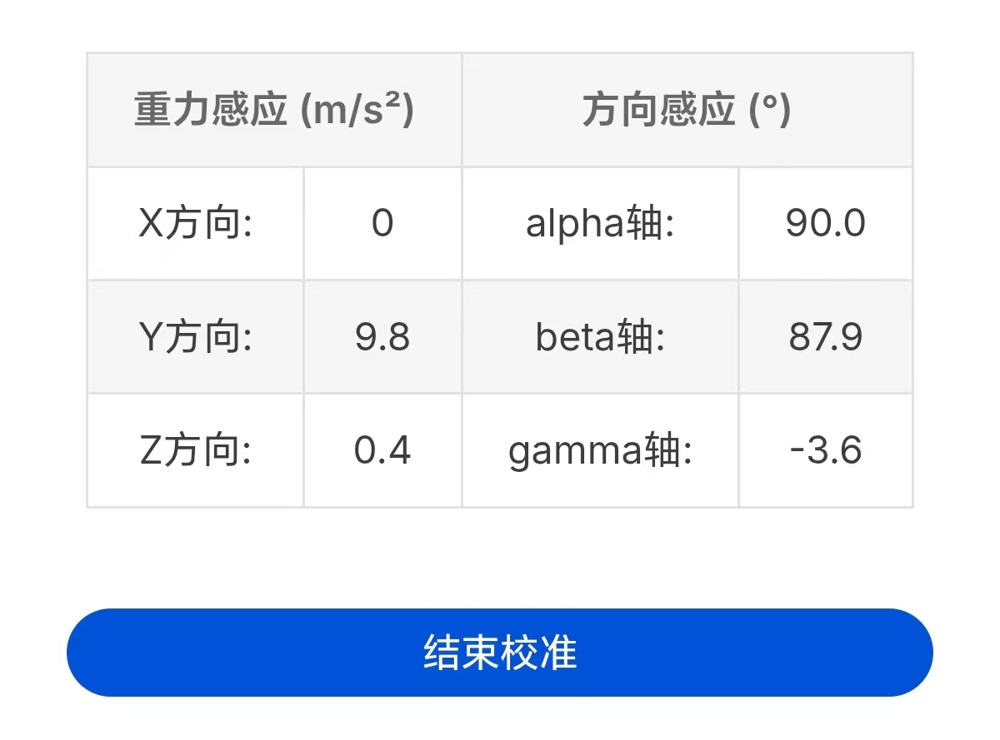
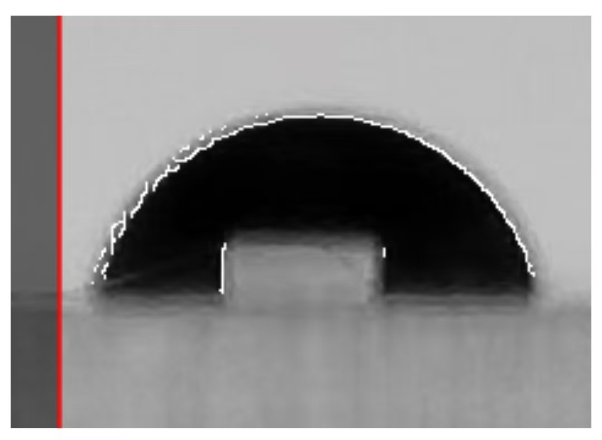
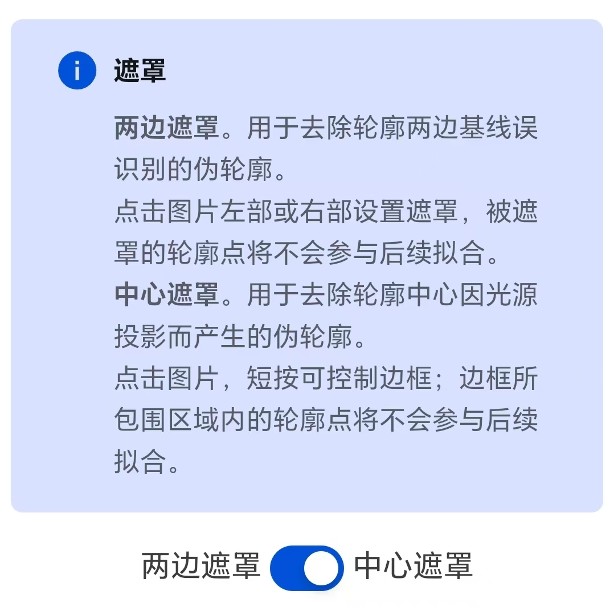
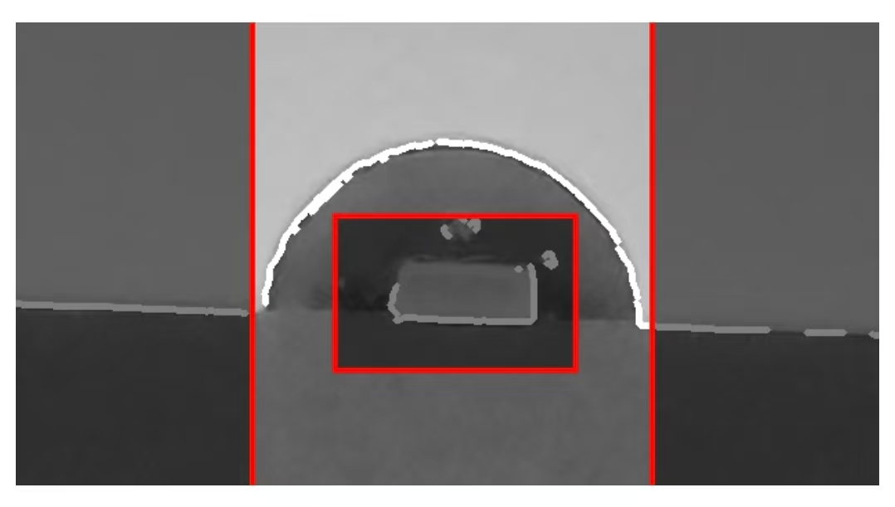
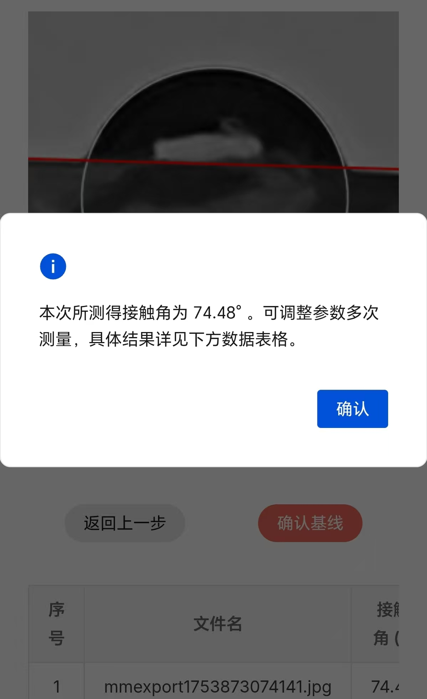
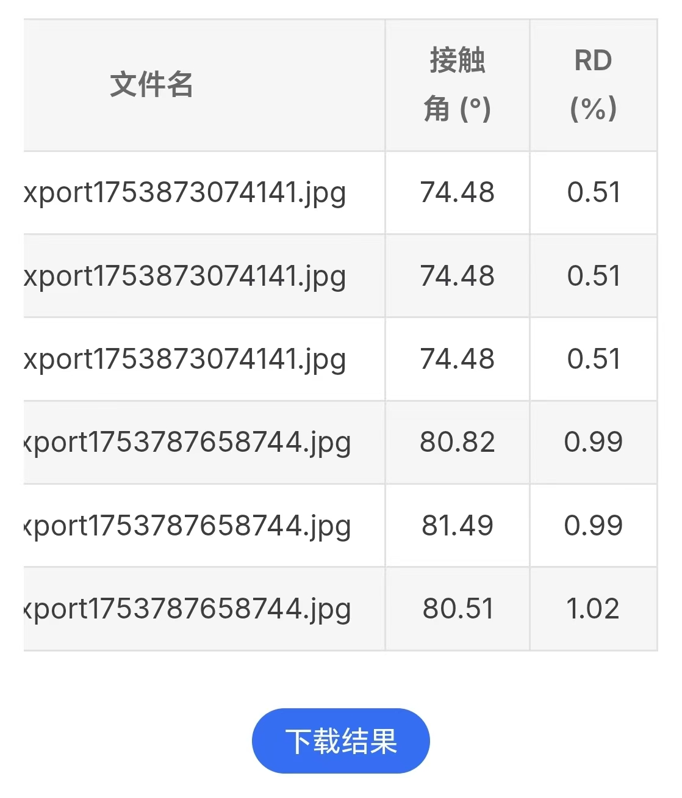

# Contact Angle

> [!warning] This business includes two WebApps:：
> 
> 1.  [**Equipment vertical calibration**](vertical-calibration.md). It can meet the vertical calibration operation requirements of mobile phones before contact Angle measurement.
> 
> 2.  [**Droplet Photo Processing**](drop-pic-process.md). It can meet all kinds of processing requirements for images after contact Angle measurement and obtain the final contact Angle data.

[[toc]]

## 1.  Overview of Contact Angle

液体在固体上的表面张力性质一般以固体的表面润湿性能进行描述，最为容易测量并定量的润湿性能参数即为**接触角**：接触角（contact angle）是液滴在固体表面处于平衡状态时，气-液界面与固-液界面的夹角（$θ$），如图1所示：

The surface tension property of a liquid on a solid is generally described by the surface wetting performance of the solid. The most easily measurable and quantifiable wetting performance parameter is the **contact angle**: The contact angle is the angle ($θ$) between the gas - liquid interface and the solid - liquid interface when the liquid droplet is in equilibrium on the solid surface, as shown in Figure 1: 

<MyPicHead>Figure 1  Definition diagram of the contact Angle</MyPicHead>

In figure 1, $σ_\mathrm{sg}$ for solid - gas interfacial tension, $σ_\mathrm{lg}$ for liquid - gas interfacial tension, $σ_\mathrm{sl}$ represents the interfacial tension between solid and liquid, and $θ$ is the contact angle. Obviously, when the droplet is in equilibrium, it satisfies equation (1):

$$ \tag{1}
  σ_\mathrm{lg} \cdot \cos{θ} + σ_\mathrm{sl} = σ_\mathrm{sg}
$$

equation (1) is the Young equation, also known as the wetting formula. Furthermore, it can be obtained that:

$$ \tag{2}
  \cos{θ} = \frac{σ_\mathrm{sg} - σ_\mathrm{sl}}{σ_\mathrm{lg}} 
$$

When 0° < $θ$ < 90°, 1 > $\cos{θ}$ > 0, the $σ_\mathrm{SV}$ > $σ_\mathrm{SL}$. Solid surfaces tend to be wetted by liquids.

When 90° < $θ$ < 180°, 0 > $\cos{θ}$ > -1, the $σ_\mathrm{SV}$ < $σ_\mathrm{SL}$. Solid surfaces tend not to be wetted by liquids.

Therefore, when discussing the wettability of a liquid on a solid surface, a 90° contact Angle is generally used as the criterion for whether it wets or not: $θ$ > 90° indicates non-wettability, and $θ$ < 90° indicates wettability.

Due to the universality and ease of use of contact Angle measurement, it can be said that contact Angle has become one of the most important parameters for characterizing the surface tension properties of liquids on solids, and contact Angle measurement operations have also become one of the de facto standards for characterizing surface wettability. Meanwhile, through the measurement of the contact Angle, the critical micelle concentration data of the surfactant can also be calculated.

## 2.  Vertical calibration of equipment

[**Link to the vertical calibration function of the equipment**](vertical-calibration.md)

This function is relatively simple. After clicking "Call Sensor", you can use the phone's own sensor to perform necessary vertical calibration operations on the phone.

The vast majority of mobile phones have both **gravity sensing** and **direction sensing** implementations. Therefore, this function briefly explains the advantages and disadvantages of these two implementations and provides operation suggestions. Typical explanations and suggestions are as follows:

When using this function, the typical data information interface is as follows:

After calibration is completed, you can return to the previous page or jump to another page to exit the vertical calibration. You can also click the "End Calibration" button to temporarily exit the calibration.

## 3.  Droplet photo processing

[**Link to droplet photo processing function**](drop-pic-process.md)

The droplet photo processing function mainly consists of the following steps:

### 3.1 Read images / Upload images

After clicking to read the image, the software will automatically perform grayscale processing on the image. And draw a grayscale image for the next step of operation.

> [!info] Tips：
> 
> After uploading the picture, you can click this button to re-upload the picture (as shown in the following picture).
> 
> Therefore, it is possible to continuously process multiple images without refreshing the page.

### 3.2 Crop the picture to the appropriate size

This step is mainly completed by clicking on the grayscale image. The specific operation functions include: short press to control the expansion/reduction of the border in the cropping area; Long press to clear the existing selection box.

> [!info] Tips：
> 
> You can click the "Crop" button **repeatedly**. It is recommended to crop photos in small quantities multiple times, which can greatly simplify the cropping process.

A typical recommended cutting size is shown in the following figure:

After obtaining a relatively ideal cropping result, select the most ideal red box to be cropped, click the "Finish Cropping" button to end the cropping, and proceed to the next step.

### 3.3 Search for the best outline of the droplet

This step mainly involves adjusting the slide rail to modify the parameters of the contour search algorithm in real time and to view the contour effect in real time.

In particular, when there are many "misidentified contour lines", the misidentified contour lines can be manually filtered through the "side mask" and "center Mask" functions.

#### 3.3.1 Contour / Edge detection

This application offers two edge detection methods ([**Canny Algorithm**](https://docs.opencv.ac.cn/4.12.0/d7/de1/tutorial_js_canny.html) and [**Thresholding Method**](https://docs.opencv.ac.cn/4.12.0/d7/dd0/tutorial_js_thresholding.html)) to find contours. The detection method switch is located at the top of the image. And a simple description of this algorithm is attached above the switch, as shown in the following figure:

Of the two algorithms, the Canny algorithm has two parameters (hence two sliders are provided below the image), while the thresholding method has one parameter (hence one slider is provided below the image). To facilitate fine-tuning of parameters, this software provides a "Switch Fine adjustment/Switch coarse adjustment" button. After switching, the range value of the slide rail can be refined/coarsely adjusted. The slide rail and the fine adjustment/fine-tuning switch button are shown in the following figure.

Adjusting the slide rail allows you to view the contour effect in real time (superimposing the contour line on the grayscale image). The ideal contour effect is as shown in the following figure:

In most cases, there will be a bright area in the middle of the captured droplet that is similar in shape to the light source. This is because the droplet surface projects the shape of the light source behind the droplet through the droplet onto the center of the image.

This optical phenomenon is extremely common under strong light sources and high contrast conditions.

In this case, the bright area in the middle of the droplet will inevitably be misidentified as a contour by the contour search algorithm. **At this point, the slide rail should be adjusted as much as possible while ensuring that the contour of the droplet can be identified as accurately as possible, so as to minimize the misidentification of the contour line in the middle of the droplet.** In this case, the typical contour recognition effect that is more recommended is shown in the following figure:

To address the issue of misrecognized contours in the middle of the droplet, this software independently designs an "iterative filtering algorithm": when the middle contour line is significantly less than the external true contour line, the iterative filtering algorithm of this software will automatically filter out the misrecognized contour line in the middle.

Of course, there are also situations where parameter tuning cannot filter out misrecognized contour lines. In such cases, the following "mask" function can be used to manually filter out misrecognized contour lines.

#### 3.3.2 Mask

This application offers two masking methods: **center masking** and **side masking**. The mask toggle switch and the mask function introduction are both located at the top of the picture. As shown in the following figure:

When the light transmittance of a solid substrate is poor, the outline of the solid substrate may also be mistakenly identified as the outline of a droplet. At this point, you can use the "**Side Mask**" function. Click on the left or right part of the picture to set the mask and cover the contour lines that are mistakenly recognized on the solid base. The masked contour points will not participate in the subsequent fitting. **This step does not need to pursue extreme precision, as the iterative filtering algorithm of this software can automatically filter out a small number of unmasked misidentified solid substrate lines.** A typical situation of this kind is shown in the following figure:

Similarly, when the "misidentified contour lines" in the middle cannot be cleared through parameter adjustment, the "**Center Mask**" function can be used to manually filter out the misidentified contour lines. The interaction logic of the center mask is similar to that of image cropping and will not be elaborated here. A typical situation of this kind is shown in the following figure:

By rationally using the parameter adjustment slide rail and mask functions, the true contour lines can be as many as possible and the misrecognized contour lines can be as few as possible. This can achieve a better contour recognition effect.

> [!info] Tips：
> 
> Adjust the slide rail as much as possible to minimize the number of misidentified contour lines in the middle of the droplet.
> 
> Adjust the left and right mask areas to cover the misidentified contour lines on the solid substrate (roughly covering most of them is sufficient).

After completing the contour search, you can click the "Confirm Contour" button to achieve the iteration and fitting of the contour. **If the fitting effect is not good, you can click "Go Back to Previous Step" at any time to search for the contour again.**

### 3.4 Search for the baseline

This step will find the baseline of the droplet based on the fitted elliptical contour line obtained in Step 3.

The typical operation functions and implementation effects are as shown in the following figure:

You can roughly adjust the baseline by directly clicking on the image: Clicking on the left or right side of the image can roughly adjust the left or right intercept of the baseline. Click the middle of the picture to pan the baseline up or down.

Based on the coarse adjustment, slide the slider at the bottom of the image to fine-tune the left/right intercept of the baseline.

After determining the intercept of the baseline, click the "Confirm Baseline" button, and the software will automatically calculate the contact Angle.

### 3.5 Calculate the contact Angle

The software will automatically calculate the determination coefficient of contour fitting, the values of the left and right contact angles, the average value of the contact angles, and the Deviation of the left and right contact angles.

After the calculation is completed, this software will inform the user of the average contact Angle data in the form of a pop-up notification. A typical pop-up notification is shown in the following figure:

In addition to pop-up notifications, the file name, average antenna value, and relative deviation value will be displayed in table form at the bottom of the page:

The "Download" button below the table allows you to download the excel table file containing all the data.

## 4.  Other content expansion

### 4.1 ImageJ

ImageJ is an open-source image processing software maintained by the National Institutes of Health (NIH) in the United States. This software is widely used in image analysis in fields such as biology, medicine, and physics. It can be said that ImageJ is the most commonly used image processing software in the scientific research field, without any doubt.

This business drew on the contact Angle plugin of ImageJ and completed the development of the contact Angle image processing software.

In addition, ImageJ is equipped with many powerful functions such as image filtering, morphological operations, edge detection, and region extraction. It can meet various business needs such as cell counting and measurement, protein gel analysis, quantitative analysis of tissue sections, and electron microscope image processing, providing great convenience for scientific researchers.

The official website link of ImageJ: [https://imagej.net/ij/index.html](https://imagej.net/ij/index.html)

<!--
  样式层
 -->

